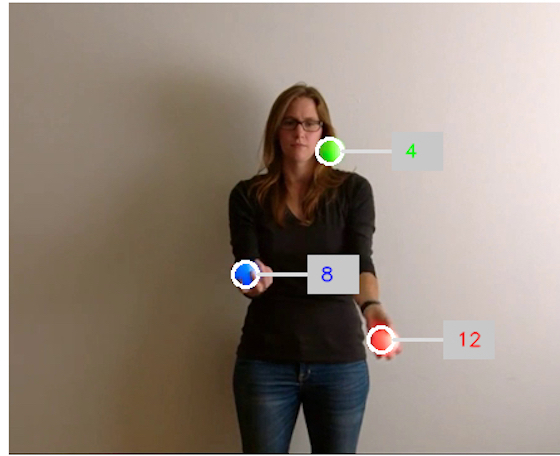
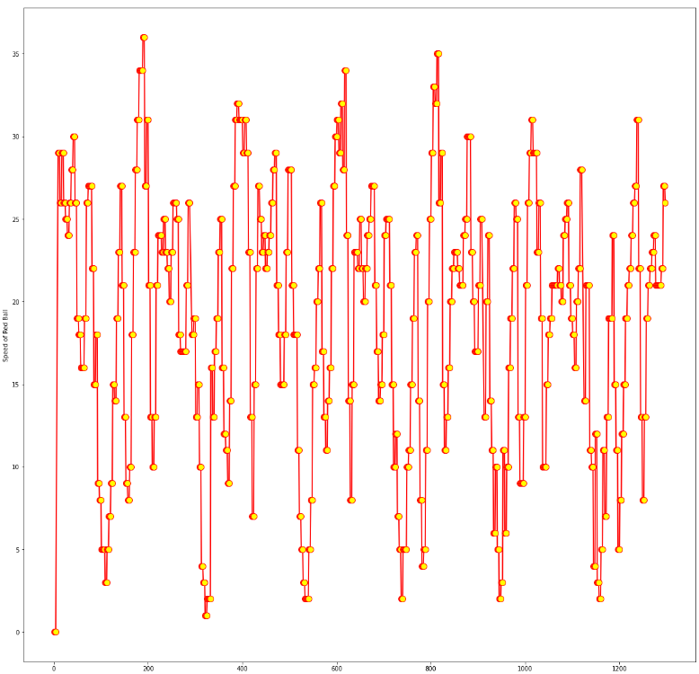
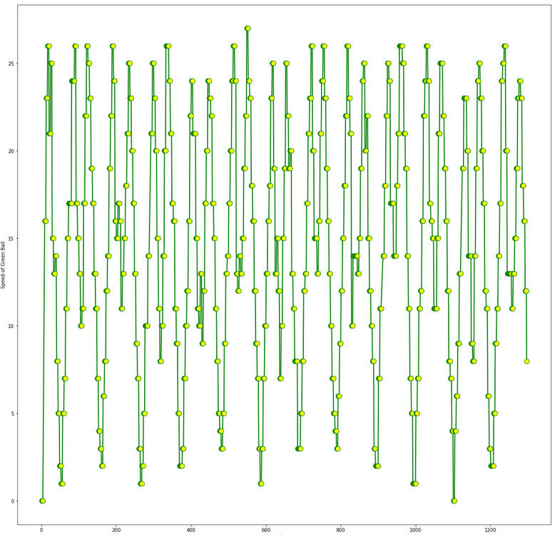
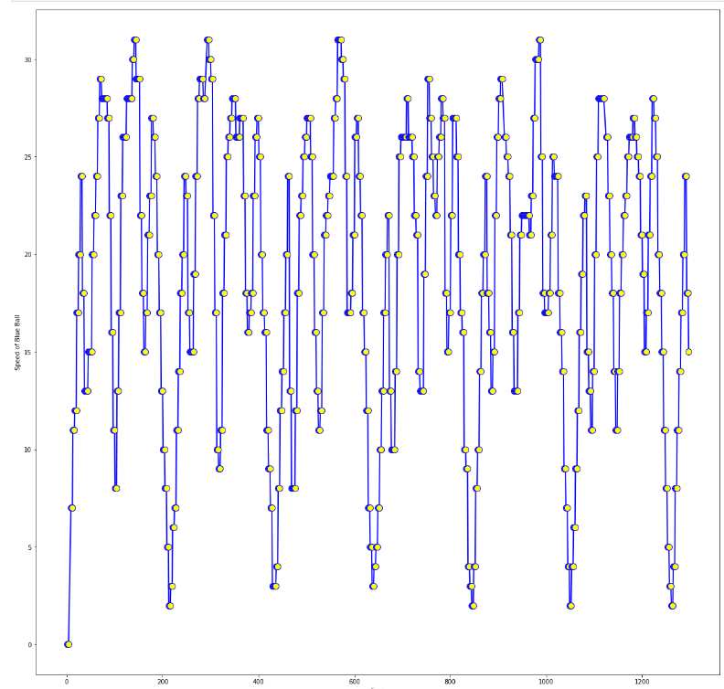

# Ball Tracking and Speed Calculation

This repository provides an implementation for **ball tracking** and **speed calculation** using computer vision techniques. It is ideal for detecting and analyzing the movement of a ball in a video feed.

---

## Table of Contents

1. [Overview](#overview)
2. [Features](#features)
3. [Dependencies](#dependencies)
4. [Setup Instructions](#setup-instructions)
5. [Usage](#usage)
6. [How It Works](#how-it-works)
7. [Example Results](#example-results)
8. [Contributing](#contributing)
9. [License](#license)

---

## Overview

The project aims to detect a ball in a video or live camera feed, track its position over time, and calculate its speed based on frame rate and pixel-to-distance calibration. This can be used for sports analysis, motion tracking, and other real-time object analysis tasks.

---

## Features

- **Real-Time Ball Detection:** Track a moving ball in video streams or live feeds.
- **Speed Calculation:** Calculates the ball's speed using positional changes over frames.
- **Customizable:** Adjustable parameters for detection sensitivity and speed computation.
- **Visualization:** Displays the tracked ball trajectory and speed on video frames.
- **Lightweight:** Efficient implementation suitable for low-resource environments.

---

## Required Dependencies

Ensure you have the following installed before running the project:

- Python
- Jupyter Notebook
- OpenCV
- NumPy
- Matplotlib (optional)

---

## Setup Instructions

1. **Clone the Repository**

   Clone this repository to your local machine using the following command:

   ```bash
   git clone https://github.com/tayyabwahab/Ball_Tracking_Speed_Calculation.git
   ```

2. **Navigate to the Project Directory**

   ```bash
   cd Ball_Tracking_Speed_Calculation
   ```
3. **Setting up Virtual Environment**

   It is recommended to use a virtual environment to avoid conflicts with other projects.

   ```bash
   pip install virtualenv    # Install virtualenv to create virtual environments1
   virtualenv VEnv           # Create Virtual Environment
   source VEnv/bin/activate  # Activate Virtual Environment (On Windows use `VEnv\Scripts\activate)`
   ```

4. **Install Dependencies**

   Use the provided command to install all required libraries:

   ```bash
   pip install -r requirements.txt
   ```

5. **Install Jupyter Notebook**

   Ensure Jupyter Notebook is installed to run the code:

   ```bash
   pip install notebook
   ```
---

## Usage

1. **Run the Jupyter Notebook**

   Open the Jupyter notebook and execute the cells sequentially:

   ```bash
   jupyter notebook
   ```

   - Open the notebook file named `Balls_tracking_speed_trajectory.ipynb`.
   - Adjust file paths, path to video input and output.

2. **Adjust Parameters**

   Parameters such as color thresholds and pixel-to-distance ratio can be adjusted within the notebook for better performance.

3. **Results**

Here is how the output looks like:



Below are the trajectories of each ball in the video. 


| Red Ball | Green Ball | Blue Ball |
|-------------- |-------------- | |-------------- |
|  |  |  |


---

## How It Works

1. **Preprocessing**: The input video is preprocessed using OpenCV for noise reduction and color space conversion.
2. **Ball Detection**:
   - A color-based thresholding technique detects the ball.
   - Contour detection identifies the position of the ball in each frame.
3. **Position Tracking**: The ball's position is tracked across consecutive frames.
4. **Speed Calculation**:
   - Speed is calculated using the distance traveled between consecutive positions, considering the video frame rate and pixel-to-distance calibration.
5. **Visualization**: The balls, their speed and trajectories are overlaid on original video and saved..

---

## Example Results

Sample output:

- **Tracked Video**: Displaying the ball's path and speed annotations.
- **Speed Output**: Logged in the console or saved as a CSV file.

---

## Contributing

Contributions are welcome! If you'd like to improve or extend the functionality of this project, feel free to:

1. Fork the repository.
2. Create a feature branch.
3. Commit your changes.
4. Submit a pull request.

For major changes, please open an issue first to discuss what you would like to improve.

---

## License

This project is licensed under the MIT License. See the [LICENSE](LICENSE) file for details.

---

## Acknowledgments

Special thanks to the contributors and the OpenCV community for providing tools and resources for computer vision projects.

---

**Author**: Tayyab Wahab  
**GitHub**: [tayyabwahab](https://github.com/tayyabwahab)
